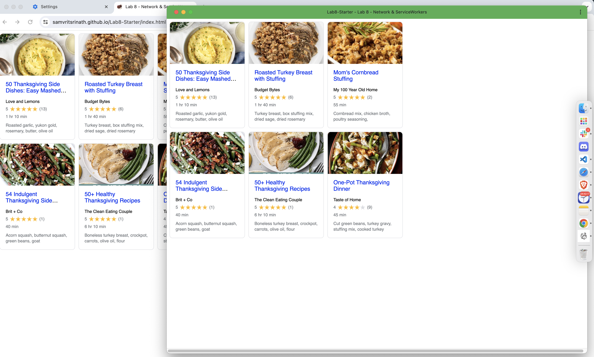

# Lab8-Starter

This Lab contains the submission for **Samvrit Srinath** for Lab 8: Fetch API's and Service Workers. 

The deployed site can be found at: [https://samvritsrinath.github.io/Lab8-Starter/index.html](https://samvritsrinath.github.io/Lab8-Starter/index.html)

## Service Workers and Graceful Degradation

Service Workers and Graceful Degredation are correlated due to the fact that Service Workers can be used to cache the contents of a website and provide them even when a user is offline. A key tenet of Graceful Degredation is to offer the highest level of functionality to users, when the User Environment supports it. In this case, we are considering whether or not the user is online or offline. Regardless of network conenctivity, we **degrade** the user experience by providing a cached version of the website. This is where Service Workers come in to provide this cached resource. While the full functionality of the app cannot be experienced offline, the user can still access the website and view the cached content and navigate through the website. This allows the user to engage with the service regardless of their network connectivity. Thus, Web Apps can be designed to gracefully degrade in the absence of network connectivity by using Service Workers to cache the website's content. And we implement this custom service worker in the `sw.js` file, where we fetch the resources in `RECIPE_URLS` and cache them for future use. 

### PWA Screenshot

Please take a note of the screenshot in `pwa.png` The icon appears to the right sidebar as the intended Turkey Icon. 

